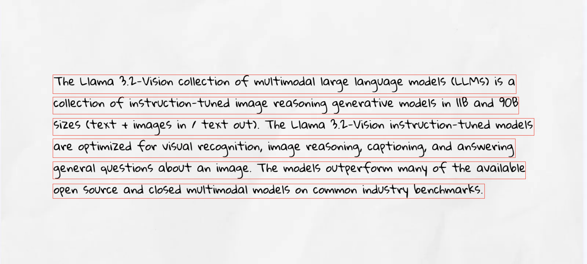

# MacOS Vision OCR

A powerful command-line OCR tool built with Apple's Vision framework, supporting single image and batch processing with detailed positional information output.

## Features

- Support for multiple image formats (JPG, JPEG, PNG, WEBP)
- Single image and batch processing modes
- Multi-language recognition (supporting 16 languages including English, Chinese, Japanese, Korean, and European languages)
- Detailed JSON output with text positions and confidence scores
- Debug mode with visual bounding boxes
- Support for both arm64 and x86_64 architectures

## System Requirements

- macOS 10.15 or later
- Support for arm64 (Apple Silicon) or x86_64 (Intel) architecture

> It is recommended that macOS 13 or later be used in preference to macOS 13 or later for the best OCR recognition.

## Installation

### Build from Source

1. Ensure Xcode and Command Line Tools are installed

2. Clone the repository:

```bash
git clone https://github.com/your-username/macos-vision-ocr.git
cd macos-vision-ocr
```

3. Build for your architecture:

For Apple Silicon (arm64):

```bash
swift build -c release --arch arm64
```

For Intel (x86_64):

```bash
swift build -c release --arch x86_64
```

## Usage

### Single Image Processing

Process a single image and output to console:

```bash
./macos-vision-ocr --img ./images/handwriting.webp
```

Process with custom output directory:

```bash
./macos-vision-ocr --img ./images/handwriting.webp --output ./images
```

### Batch Processing

Process multiple images in a directory:

```bash
./macos-vision-ocr --img-dir ./images --output-dir ./output
```

Merge all results into a single file:

```bash
./macos-vision-ocr --img-dir ./images --output-dir ./output --merge
```

### Debug Mode

Enable debug mode to visualize text detection:

```bash
./macos-vision-ocr --img ./images/handwriting.webp --debug
```



### Command Line Options

```
Options:
  --img <path>          Path to a single image file
  --output <path>       Output directory for single image mode
  --img-dir <path>      Directory containing images for batch mode
  --output-dir <path>   Output directory for batch mode
  --merge              Merge all text outputs into a single file in batch mode
  --debug              Debug mode: Draw bounding boxes on the image
  --lang               Show supported recognition languages
  --help               Show help information
```

## Output Format

The tool outputs JSON with the following structure:

```json
{
  "texts": "The Llama 3.2-Vision Collection of multimodal large langyage model5 （LLMS） is a\ncollection of instruction-tuned image reasoning generative models in l1B and 90B\nsizes （text + images in / text ovt）. The Llama 3.2-Vision instruction-tuned models\nare optimized for visval recognittion, iage reasoning, captioning, and answering\ngeneral qvestions about an iage. The models outperform many of the available\nopen Source and Closed multimodal models on common industry benchmarKs.",
  "info": {
    "filepath": "./images/handwriting.webp",
    "width": 1600,
    "filename": "handwriting.webp",
    "height": 720
  },
  "observations": [
    {
      "text": "The Llama 3.2-Vision Collection of multimodal large langyage model5 （LLMS） is a",
      "confidence": 0.5,
      "quad": {
        "topLeft": {
          "y": 0.28333333395755611,
          "x": 0.09011629800287288
        },
        "topRight": {
          "x": 0.87936045388666206,
          "y": 0.28333333395755611
        },
        "bottomLeft": {
          "x": 0.09011629800287288,
          "y": 0.35483871098527953
        },
        "bottomRight": {
          "x": 0.87936045388666206,
          "y": 0.35483871098527953
        }
      }
    }
  ]
}
```

## Debug Output

When using `--debug`, the tool will:

1. Create a new image with "\_boxes.png" suffix
2. Draw red bounding boxes around detected text
3. Save the debug image in the same directory as the input image

## Supported Languages

- English (en-US)
- French (fr-FR)
- Italian (it-IT)
- German (de-DE)
- Spanish (es-ES)
- Portuguese (Brazil) (pt-BR)
- Simplified Chinese (zh-Hans)
- Traditional Chinese (zh-Hant)
- Simplified Cantonese (yue-Hans)
- Traditional Cantonese (yue-Hant)
- Korean (ko-KR)
- Japanese (ja-JP)
- Russian (ru-RU)
- Ukrainian (uk-UA)
- Thai (th-TH)
- Vietnamese (vi-VT)

## Node.js Integration Example

Here's an example of how to use `macos-vision-ocr` in a Node.js application:

```javascript
const { exec } = require("child_process");
const util = require("util");
const execPromise = util.promisify(exec);

async function performOCR(imagePath, outputDir = null) {
  try {
    // Construct the command
    let command = `./macos-vision-ocr --img "${imagePath}"`;
    if (outputDir) {
      command += ` --output "${outputDir}"`;
    }

    // Execute the OCR command
    const { stdout, stderr } = await execPromise(command);

    if (stderr) {
      console.error("Error:", stderr);
      return null;
    }

    // Parse the JSON output
    console.log("stdout:", stdout);
    const result = JSON.parse(stdout);
    return result;
  } catch (error) {
    console.error("OCR processing failed:", error);
    return null;
  }
}

// Example usage
async function example() {
  const result = await performOCR("./images/handwriting.webp");
  if (result) {
    console.log("Extracted text:", result.texts);
    console.log("Text positions:", result.observations);
  }
}

example();
```

## Common Issues

1. **Image Loading Fails**

   - Ensure the image path is correct
   - Verify the image format is supported (JPG, JPEG, PNG, WEBP)
   - Check file permissions

2. **No Text Detected**
   - Ensure the image contains clear, readable text
   - Check if the text size is not too small (minimum text height is 1% of image height)
   - Verify the text language is supported

## License

This project is licensed under the MIT License - see the [LICENSE](LICENSE) file for details.

## Acknowledgments

Built with:

- Apple Vision Framework
- Swift Argument Parser
- macOS Native APIs
